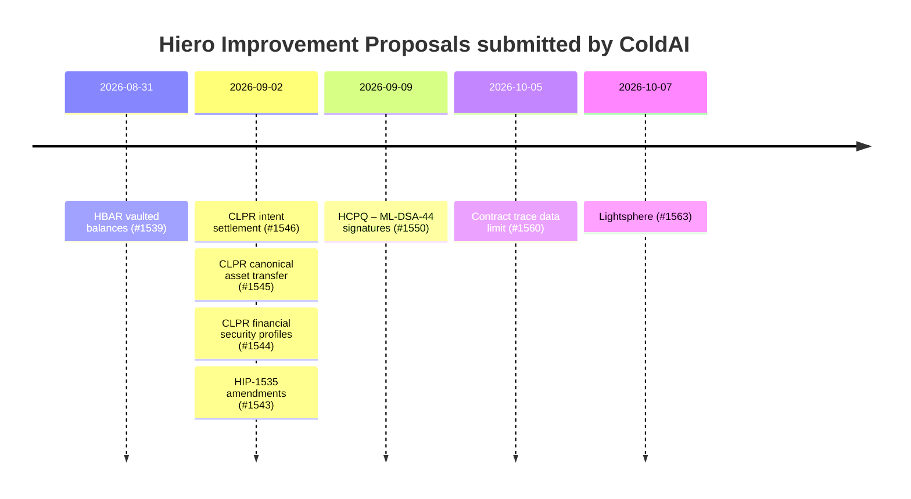

<p align="center">
  <a href="https://coldai.org">
    <picture>
      <source media="(prefers-color-scheme: dark)" srcset=".github/assets/coldai-logo-white.png">
      
    </picture>
  </a>
</p>

<h1 align="center">Hiero Improvement Proposals by ColdAI</h1>

<p align="center">
  <strong>Every HIP we have submitted to Hiero, in one place, kept current automatically.</strong><br>
  Post-quantum signatures, account-level HBAR vaults, off-ledger execution, clearer contract limits, and the
  application standards that make CLPR safe for real money.
</p>

<!-- stats:start -->
<p align="center">
  
  
  
  
</p>
<!-- stats:end -->

<p align="center">
  <a href="https://github.com/ColdAI-org/hips/actions/workflows/sync.yml"></a>
  <a href="LICENSE"></a>
  <a href="https://github.com/hiero-ledger/hiero-improvement-proposals/pulls?q=is%3Apr+author%3Ashayansal"></a>
</p>

<p align="center">
  <a href="#at-a-glance">At a glance</a> ·
  <a href="#by-theme">By theme</a> ·
  <a href="#timeline">Timeline</a> ·
  <a href="#how-we-write-hips">How we write HIPs</a> ·
  <a href="#how-this-repository-works">How this repository works</a>
</p>

---

[Hiero](https://hiero.org) is the open-source distributed ledger behind Hedera, hosted by LF Decentralized Trust.
Changes to Hiero, and standards built on it, are proposed as **Hiero Improvement Proposals (HIPs)** in
[hiero-ledger/hiero-improvement-proposals](https://github.com/hiero-ledger/hiero-improvement-proposals) and decided
in the open, as [HIP-1](https://github.com/hiero-ledger/hiero-improvement-proposals/blob/main/HIP/hip-1.md)
describes. This repository collects every HIP that [ColdAI](https://coldai.org) has submitted, with a summary, its
status, the implementation work behind it, and a snapshot of the full text.

> [!NOTE]
> The pull requests in the Hiero repository are the source of truth. Every proposal here is a draft under public
> review until Hiero's process says otherwise. Comments belong on the pull request or the HIP's discussion, not in
> this repository.

## At a glance

<!-- table:start -->
| PR | Proposal | Category | Theme | Status | Submitted | Implementation |
|---|---|---|---|---|---|---|
| [#1563](https://github.com/hiero-ledger/hiero-improvement-proposals/pull/1563) | [**Lightsphere - Off-Ledger Execution Spheres Anchored to Hiero**](proposals/1563-lightsphere.md) | Application | Scaling and off-ledger execution | Draft · open | 2026-10-07 | [ColdAI-org/lightsphere](https://github.com/ColdAI-org/lightsphere) |
| [#1560](https://github.com/hiero-ledger/hiero-improvement-proposals/pull/1560) | [**Explicit Status and Pre-flight Parity for the Contract Trace Data Size Limit**](proposals/1560-contract-trace-data-limit.md) | Service | Smart contracts and developer experience | Draft · draft PR | 2026-10-05 | [Evidence on Hedera testnet](https://github.com/ColdAI-org/clprouter/blob/main/docs/lfdt/hedera-trace-cap.md)<br>[LFDT-CLPR/clpr-smart-contracts#37](https://github.com/LFDT-CLPR/clpr-smart-contracts/pull/37)<br>[LFDT-CLPR/clpr-smart-contracts#38](https://github.com/LFDT-CLPR/clpr-smart-contracts/pull/38) |
| [#1550](https://github.com/hiero-ledger/hiero-improvement-proposals/pull/1550) | [**Ledger-Bound ML-DSA-44 Transaction Signatures**](proposals/1550-hcpq-ml-dsa-44-signatures.md) | Core | Account security and post-quantum signatures | Draft · open | 2026-09-09 | [hiero-ledger/hiero-cryptography#693](https://github.com/hiero-ledger/hiero-cryptography/pull/693)<br>[hiero-ledger/hiero-consensus-node#27253](https://github.com/hiero-ledger/hiero-consensus-node/pull/27253) |
| [#1546](https://github.com/hiero-ledger/hiero-improvement-proposals/pull/1546) | [**CLPR Intent Settlement and Liquidity Clearing Standard**](proposals/1546-clpr-intent-settlement-liquidity-clearing.md) | Application | Cross-ledger interoperability (CLPR) | Draft · open | 2026-09-02 | Specification |
| [#1545](https://github.com/hiero-ledger/hiero-improvement-proposals/pull/1545) | [**CLPR Canonical Asset Transfer Standard**](proposals/1545-clpr-canonical-asset-transfer.md) | Application | Cross-ledger interoperability (CLPR) | Draft · open | 2026-09-02 | Specification |
| [#1544](https://github.com/hiero-ledger/hiero-improvement-proposals/pull/1544) | [**CLPR Financial Security Profiles and Value Guards**](proposals/1544-clpr-financial-security-profiles.md) | Application | Cross-ledger interoperability (CLPR) | Draft · open | 2026-09-02 | Specification |
| [#1539](https://github.com/hiero-ledger/hiero-improvement-proposals/pull/1539) | [**HBAR Vaulted Balances with Delayed Release and Recovery**](proposals/1539-hbar-vaulted-balances.md) | Service | Account security and post-quantum signatures | Draft · open | 2026-08-31 | Specification |
<!-- table:end -->

## By theme

<!-- themes:start -->
### Scaling and off-ledger execution

#### [Lightsphere - Off-Ledger Execution Spheres Anchored to Hiero](proposals/1563-lightsphere.md)

<a href="https://github.com/hiero-ledger/hiero-improvement-proposals/pull/1563"></a>  

A standard for off-ledger execution that settles to Hiero. In signed mode, 2–16 parties co-sign states and settle once. In network mode, a whole Hiero network (for example a HashSphere) connects over CLPR and has a guaranteed exit. Includes a throughput accounting rule so claims can be compared.

- **Submitted** 2026-10-07
- **Discussion** <https://github.com/hiero-ledger/hiero-improvement-proposals/discussions/1562>
- Building the reference implementation found two double-payout bugs in the first draft, both fixed in the spec
- An independent review moved signed mode from HIP-632 account-key checks to signing keys bound into each sphere
- **Implementation:** [ColdAI-org/lightsphere](https://github.com/ColdAI-org/lightsphere) — Reference implementation: contracts, Go benchmark harness, TypeScript client and watchtower. 46 tests; 46,688 effective tx/s measured on one machine
- [Read the full proposal](proposals/1563-lightsphere.md) · [Pull request](https://github.com/hiero-ledger/hiero-improvement-proposals/pull/1563)

### Account security and post-quantum signatures

#### [Ledger-Bound ML-DSA-44 Transaction Signatures](proposals/1550-hcpq-ml-dsa-44-signatures.md)

<a href="https://github.com/hiero-ledger/hiero-improvement-proposals/pull/1550"></a>  

An opt-in post-quantum transaction signature profile using standard FIPS 204 ML-DSA-44. Signatures are bound to the ledger ID and to the exact canonical transaction bytes. Existing Ed25519 and ECDSA keys are unchanged, and the profile is disabled by default.

- **Submitted** 2026-09-09 · **updated** 2026-10-01
- **Discussion** <https://github.com/hiero-ledger/hiero-improvement-proposals/pull/1550>
- **Reviewed by** @mgarbs
- Reviewed by a Hiero maintainer; every point addressed, including cross-language vectors and an algorithm-ID registry
- **Implementation:** [hiero-ledger/hiero-cryptography#693](https://github.com/hiero-ledger/hiero-cryptography/pull/693) — ML-DSA-44 profile, key IDs, transcript signing, and conformance vectors re-checked with OpenSSL
- **Implementation:** [hiero-ledger/hiero-consensus-node#27253](https://github.com/hiero-ledger/hiero-consensus-node/pull/27253) — Consensus-node integration, canonical transaction checks, and integration tests
- [Read the full proposal](proposals/1550-hcpq-ml-dsa-44-signatures.md) · [Pull request](https://github.com/hiero-ledger/hiero-improvement-proposals/pull/1550)

#### [HBAR Vaulted Balances with Delayed Release and Recovery](proposals/1539-hbar-vaulted-balances.md)

<a href="https://github.com/hiero-ledger/hiero-improvement-proposals/pull/1539"></a>  

An account-native HBAR vault. Vaulted HBAR keeps staking but can only move through a delayed, destination-bound release. During the delay, a separate guardian key can cancel the release or recover the funds to a pre-committed account, which limits the damage from a stolen signing key.

- **Submitted** 2026-08-31
- **Discussion** <https://github.com/hiero-ledger/hiero-improvement-proposals/pull/1539>
- [Read the full proposal](proposals/1539-hbar-vaulted-balances.md) · [Pull request](https://github.com/hiero-ledger/hiero-improvement-proposals/pull/1539)

### Smart contracts and developer experience

#### [Explicit Status and Pre-flight Parity for the Contract Trace Data Size Limit](proposals/1560-contract-trace-data-limit.md)

<a href="https://github.com/hiero-ledger/hiero-improvement-proposals/pull/1560"></a>  

Makes the consensus node's 262,144-byte contract trace-size cap visible as itself, with its own response code instead of INSUFFICIENT_GAS. Mirror-node simulation and the JSON-RPC relay then report the same failure before a transaction is sent.

- **Submitted** 2026-10-05
- **Discussion** <https://github.com/hiero-ledger/hiero-improvement-proposals/pull/1560>
- Found while opening a Sepolia ↔ Hedera CLPR Channel: the same call failed at every gas limit from 5.6M to 15M
- **Implementation:** [Evidence on Hedera testnet](https://github.com/ColdAI-org/clprouter/blob/main/docs/lfdt/hedera-trace-cap.md) — Write-up of the failed transactions that exposed the cap
- **Implementation:** [LFDT-CLPR/clpr-smart-contracts#37](https://github.com/LFDT-CLPR/clpr-smart-contracts/pull/37) — Documents the cap for large-calldata verifiers
- **Implementation:** [LFDT-CLPR/clpr-smart-contracts#38](https://github.com/LFDT-CLPR/clpr-smart-contracts/pull/38) — Staged verifier input that stays under the cap
- [Read the full proposal](proposals/1560-contract-trace-data-limit.md) · [Pull request](https://github.com/hiero-ledger/hiero-improvement-proposals/pull/1560)

### Cross-ledger interoperability (CLPR)

#### [CLPR Intent Settlement and Liquidity Clearing Standard](proposals/1546-clpr-intent-settlement-liquidity-clearing.md)

<a href="https://github.com/hiero-ledger/hiero-improvement-proposals/pull/1546"></a>   

Intent-based cross-ledger settlement on CLPR. Users sign the outcome they want, competing solvers fill it, and a CLPR-proven receipt releases escrow exactly once. Solvers can then net their inventory in a collateralized clearing layer.

- **Submitted** 2026-09-02
- [Read the full proposal](proposals/1546-clpr-intent-settlement-liquidity-clearing.md) · [Pull request](https://github.com/hiero-ledger/hiero-improvement-proposals/pull/1546)

#### [CLPR Canonical Asset Transfer Standard](proposals/1545-clpr-canonical-asset-transfer.md)

<a href="https://github.com/hiero-ledger/hiero-improvement-proposals/pull/1545"></a>   

One asset identity, transfer envelope and adapter interface for moving fungible assets over CLPR. It covers issuer burn/mint, lock/mint and lock/release modes, with auditable supply accounting so assets don't fragment into incompatible wrapped copies.

- **Submitted** 2026-09-02
- [Read the full proposal](proposals/1545-clpr-canonical-asset-transfer.md) · [Pull request](https://github.com/hiero-ledger/hiero-improvement-proposals/pull/1545)

#### [CLPR Financial Security Profiles and Value Guards](proposals/1544-clpr-financial-security-profiles.md)

<a href="https://github.com/hiero-ledger/hiero-improvement-proposals/pull/1544"></a>   

Machine-readable security profiles and value guards for financial apps on CLPR. A profile pins the exact ledgers, verifiers and finality rules an app relies on. A value guard enforces per-message, in-flight and time-window limits.

- **Submitted** 2026-09-02
- [Read the full proposal](proposals/1544-clpr-financial-security-profiles.md) · [Pull request](https://github.com/hiero-ledger/hiero-improvement-proposals/pull/1544)

#### Contribution: [HIP-1535: harden channel identity and emergency recovery](https://github.com/hiero-ledger/hiero-improvement-proposals/pull/1543) (HIP-1535)

Proposed amendments to HIP-1535 (CLPR) on Channel identity and emergency recovery. [Pull request #1543](https://github.com/hiero-ledger/hiero-improvement-proposals/pull/1543), 2026-09-02, +102 / −33 lines.

<!-- themes:end -->

## Timeline

<!-- timeline:start -->

<!-- timeline:end -->

## How we write HIPs

- **Grounded in something that happened.** Each proposal starts from a problem we hit while building: a contract
  that failed at every gas limit, a key-rotation hazard found in review, a double payout found by a fuzz test. The
  evidence goes in the Motivation section, with transaction links where there are any.
- **Implementation before approval.** Where we can, we build the reference implementation while the HIP is still
  a draft, because building it changes the specification. For Lightsphere, it found two design flaws in the first
  draft. For HCPQ, it produced cross-language conformance vectors.
- **Measured, not estimated.** Gas, sizes and throughput figures come from a test, a fixture or a published report
  that anyone can re-run.
- **Optional by default.** New behaviour is opt-in, and each HIP says what happens on a network that does not adopt
  it, as HIP-1's Network Optionality section asks.
- **Signed and certified.** Every commit carries a Developer Certificate of Origin sign-off and a cryptographic
  signature.

## How this repository works

| Path | What it holds |
|---|---|
| [`proposals/`](proposals) | A snapshot of each HIP's text as of its pull request's latest commit, with relative links rewritten to that commit |
| [`data/hips.json`](data/hips.json) | Generated index: status, category, dates, reviews and links for every pull request |
| [`data/curated.json`](data/curated.json) | Hand-written summaries, themes, highlights and implementation links |
| [`scripts/sync.mjs`](scripts/sync.mjs) | Fetches every HIP pull request by our authors from the GitHub API, writes the snapshots and the index, and regenerates the marked sections of this README |

A [scheduled workflow](.github/workflows/sync.yml) runs the sync every day and commits any change, so status
changes, reviews and new revisions show up here without anyone editing by hand. To run it yourself:

```bash
GITHUB_TOKEN=$(gh auth token) node scripts/sync.mjs
```

To add a new proposal, open it in the Hiero repository. The next sync picks it up. Then add its summary and theme
to `data/curated.json`.

## Licence

The HIP texts are © their authors and licensed under the
[Apache License 2.0](https://github.com/hiero-ledger/hiero-improvement-proposals/blob/main/LICENSE), as in the
Hiero repository. Everything else here is also [Apache-2.0](LICENSE).

<p align="center"><sub>Maintained by <a href="https://coldai.org">ColdAI</a>, a frontier R&amp;D lab building agentic AI and distributed-ledger systems.</sub></p>
